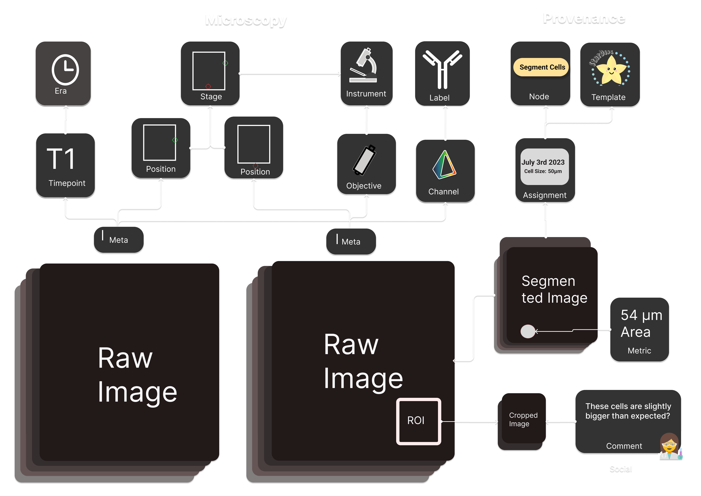

# Mikro

Mikro is the Arkitekt go to solution for all things microscopy. It provides
the datamodels and services for managing microscopy data, and connects a binary
storage system built around S3 object store (in a standard deploylement powered [Minio](https://min.io/)), with a relational
database [Postgres](https://postgressql.org) for metadata storage.

As an API first system, Mikro exposes a GraphQL API for all of its operations that
can be used by any client. It also provides a web based admin UI for interacting with
the system through a browser.

## Mikro Design

The Mikro [schema](https://arkitekt.live/docs/design/graphql#schema) is the core of the system. It defines the data models and relationships
that are used to store and retrieve data. The schema is defined in [GraphQL](https://graphql.org)
and provides the only interface to the system. You can inspect a recent [schema.graphql](/schema.graphql)
Or you can use the [API Explorer](https://arkitekt.live/explorer) to interact with the system directly.

## Developmental Notices

Mikro is currently being rewritten to support the modern Arkitekt Stack of [Django](https://djangoproject.com)  and [Strawberry GraphQL](https://strawberry.rocks/).
This repository will remain the main repository for Mikro, and the new version will be merged into this repository once the new version is ready for production.

